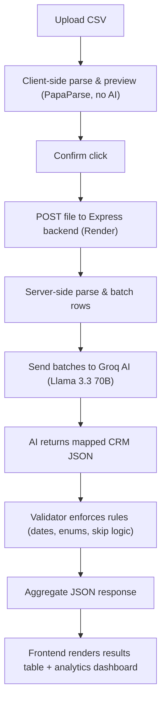
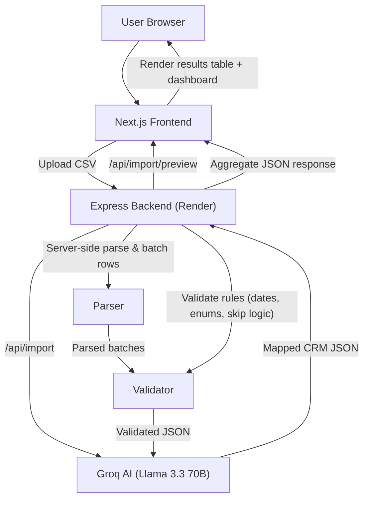
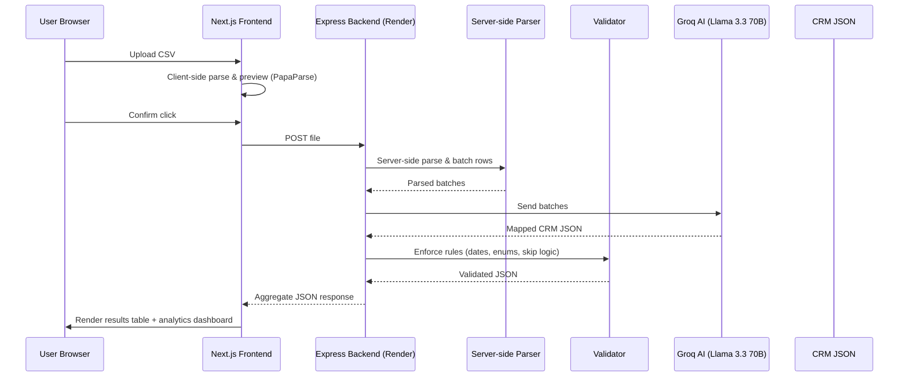

# GrowEasy AI-Powered CSV Lead Importer

## Live Links
- Frontend: https://groweasya1.vercel.app/
- Backend API: https://groweasya1.onrender.com

> Note: Backend is on Render's free tier — first request after inactivity may take 30-50s to wake up.

## Tech Stack
- Frontend: Next.js, TypeScript, Tailwind CSS, Recharts
- Backend: Node.js, Express, Multer
- AI: Groq (Llama 3.3 70B) via OpenAI-compatible SDK

## Project Structure

```
groweasy/
├── frontend/
│   ├── src/
│   │   ├── app/
│   │   │   ├── favicon.ico
│   │   │   ├── globals.css
│   │   │   ├── layout.tsx
│   │   │   └── page.tsx
│   │   ├── components/
│   │   │   ├── Analytics.tsx
│   │   │   ├── DataTable.tsx
│   │   │   ├── FileDropzone.tsx
│   │   │   └── StepIndicator.tsx
│   │   ├── lib/
│   │   │   └── api.ts
│   │   └── types/
│   │       └── crm.ts
│   ├── .env.example
│   ├── package.json
│   └── next.config.js
│
├── backend/
│   ├── config/
│   │   └── crmSchema.js
│   ├── routes/
│   │   └── import.js
│   ├── services/
│   │   ├── aiExtractor.js
│   │   ├── csvParser.js
│   │   └── validator.js
│   ├── .env.example
│   ├── package.json
│   └── server.js
│
├── .gitignore
└── README.md
```


## Local Setup

### Backend
cd backend
npm install
cp .env.example .env   # add your GROQ_API_KEY
npm run dev             # runs on http://localhost:5000

### Frontend
cd frontend
npm install
cp .env.local.example .env.local  # set NEXT_PUBLIC_API_URL
npm run dev             # runs on http://localhost:3000

## Environment Variables

**backend/.env**
GROQ_API_KEY=your_groq_api_key
PORT=5000
FRONTEND_URL=http://localhost:3000

**frontend/.env.local**
NEXT_PUBLIC_API_URL=http://localhost:5000

## Features
- Drag & drop / file picker CSV upload
- CSV preview with sticky headers, scrollable table
- Confirm-gated AI processing (no AI call until user confirms)
- Batched AI extraction with retry logic
- Post-AI validation layer (date format, enum enforcement, multi-email/mobile splitting, skip logic)
- Results table with imported/skipped counts
- Analytics dashboard (status distribution, source distribution, top cities, date validity rate)

## AI Extraction Approach
Raw CSV rows are batched (20 rows/batch) and sent to Groq's Llama 3.3 70B model with a system
prompt defining the GrowEasy CRM schema, allowed enum values, and field-mapping rules. A
deterministic validation layer runs after extraction to catch and correct any AI output that
doesn't strictly follow the rules (invalid dates, hallucinated enums, unsplit multi-value fields).


## Workflow Diagram


# System Architecture


# System Architecture (Sequence Diagram)



